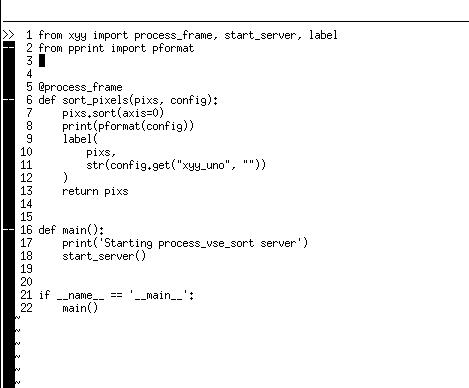

= xyy
Gabriel Montagné Láscaris-Comneno <gabriel@tibas.london>
v0.0.1

Helper library for
https://github.com/gabrielmontagne/blender-addon-process-vse-strip

It spins up a local server that will receive the addon request, load the file, turn it into a NumPy array, and pass that to the function you provide.   Then, when you return the processed array, the helper will save the file and reply to the request with the path of the new file.

For stereoscopic (top/bottom) frames, the helper will split the file into two and call your function for each side.

Install this module locally (perhaps on developer / editable mode) and use it on your implementations by importing the "start_server" function and the "process_frame" function decorator.

First, use the decorator on a function that will receive the pixels and a dictionary with additional parametric fields.  This function should return the new array of transformed pixels.

Then, start the server with the "start_server" function.

We also provide a simple "label" function that can print a label onto the pixels.

